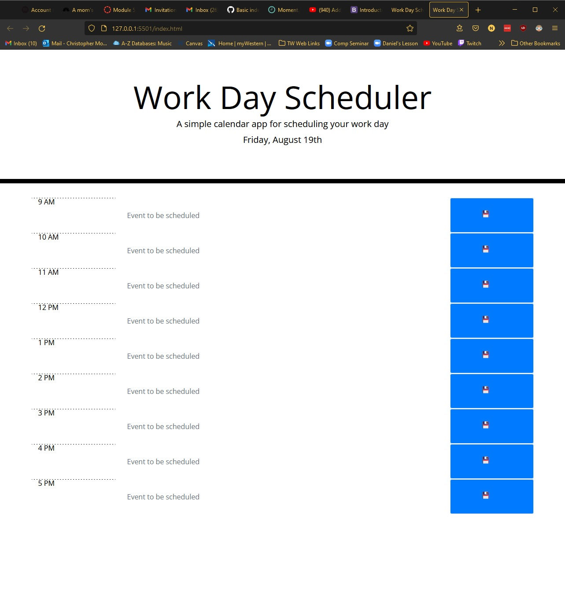
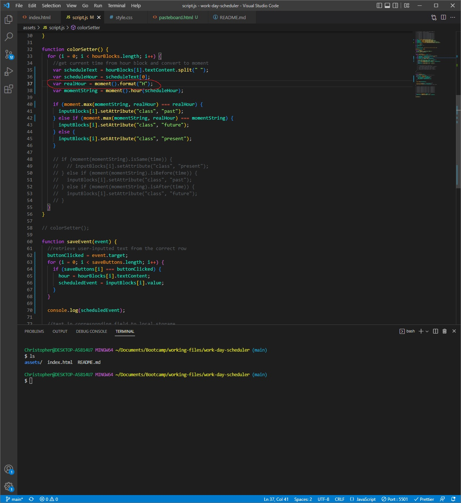
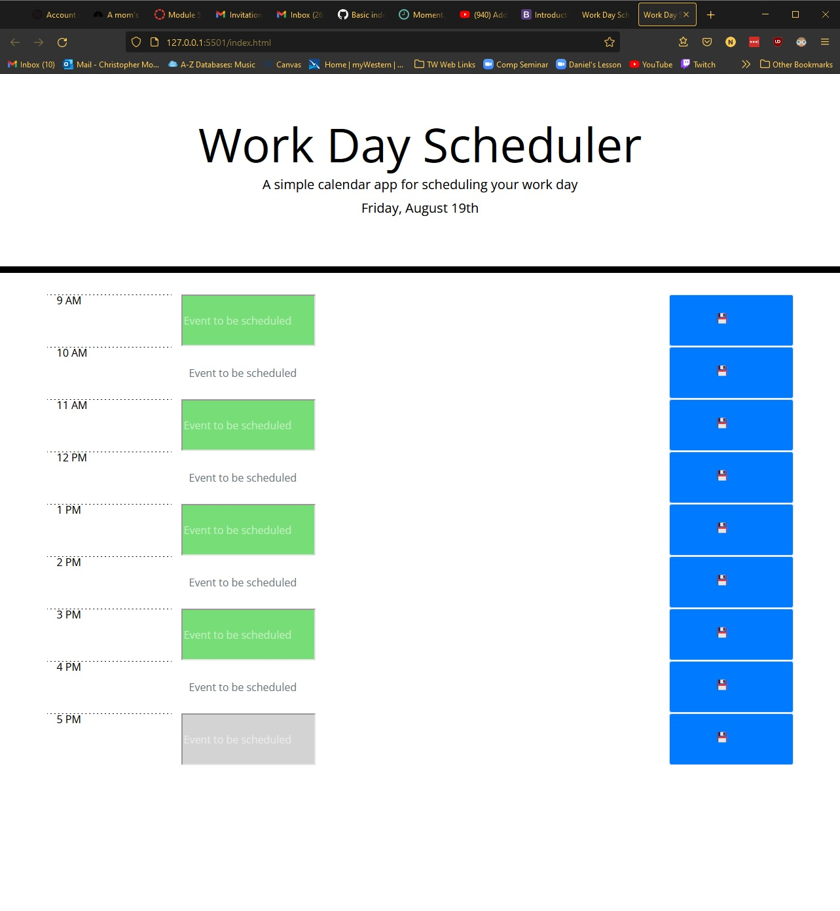
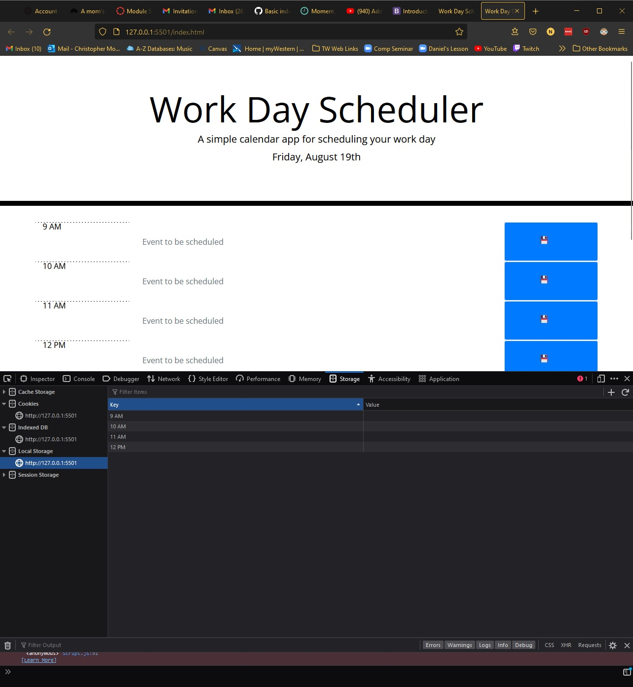

# 05 Third-Party APIs: Work Day Scheduler

This project was intended as a work day scheduler where the user can type in an event and save it to local storage. The timeblocks were also supposed to change color depending on whether the time was in the past, present, or future. 

I was able to get the basic layout and some of the functionality working, however, the color-changing blocks and saving to local storage do not work as intended. 

Every second timeblock changes color to green when line 37 is as follows. I understand why the color change works but not why it only affects every other timeblock.

Of the key-value pair I attempted to store upon clicking the save button, only the key works:

